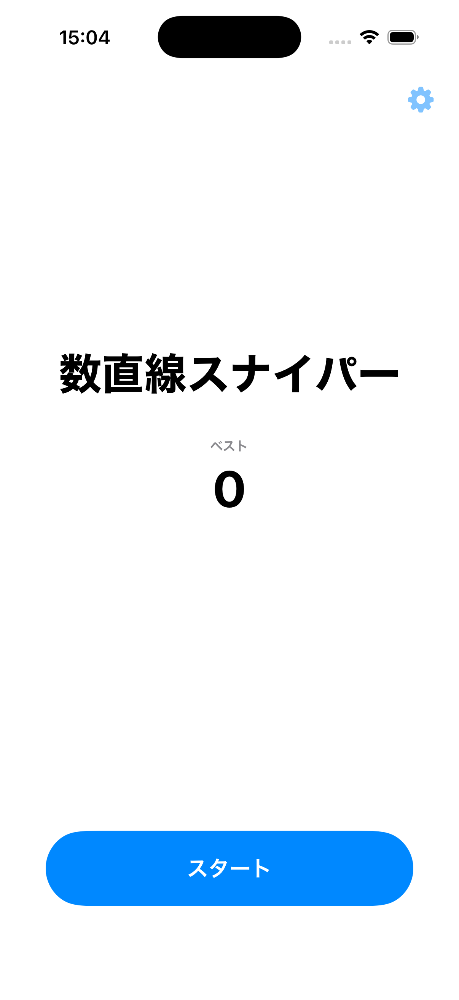
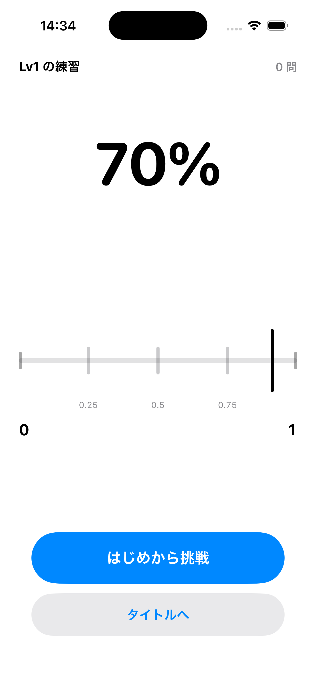
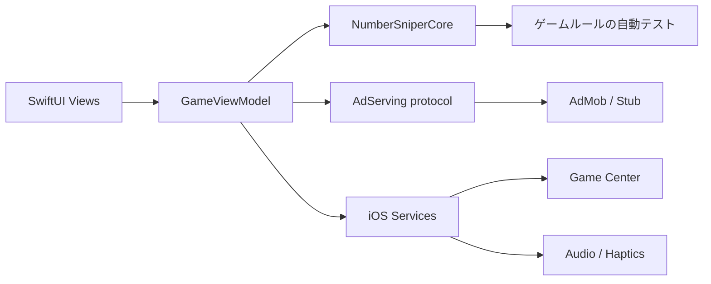

# 数直線スナイパー / Number Sniper

数直線上の位置を見極めてターゲットを狙う、SwiftUI製の数感覚トレーニングゲームです。

## Demo

| Title | Practice mode |
|---|---|
|  |  |

## What I Built

- SwiftUIによるiPhone向けゲームUIと画面遷移
- 画面や外部サービスから独立して検証できるゲームロジック
- 難易度・レベル曲線・練習モード・復活フロー
- AdMob統合例、Game Center、音声、ハプティクスのiOSサービス境界
- Privacy Manifestと、ネットワーク広告を無効化した公開用stub構成

## Engineering Highlights

### UIとゲームロジックの分離

画面座標、SwiftUI、SDK依存を`NumberSniperCore`へ持ち込まず、採点・出題・進行を純粋Swiftとして検証できます。中心となる実装は
[`GameEngine.swift`](NumberSniperCore/Sources/NumberSniperCore/GameEngine.swift)と
[`GameViewModel.swift`](NumberSniper/GameViewModel.swift)です。

### 比率で表す数直線

カーソルと正解位置を`0...1`の比率として扱うため、`0...1`、百分率、分数、変則レンジ、3桁レンジでも同じ判定経路を利用できます。

### 再現可能な乱数テスト

[`SeededRandomNumberGenerator.swift`](NumberSniperCore/Sources/NumberSniperCore/SeededRandomNumberGenerator.swift)を注入し、同じseedから同じ問題列を再現します。出題帯の境界や候補枯渇を多数のseedで検査できます。

### 外部SDKをサービス境界の外へ漏らさない

広告は[`AdServing.swift`](NumberSniper/Services/AdServing.swift)の背後に置き、実SDKとstubを交換できます。公開buildは通信しないstubが既定です。Game Center、音声、BGM、ハプティクスもiOS target側へ閉じ込めています。

## Architecture



詳しい境界とデータフローは[`docs/architecture.md`](docs/architecture.md)を参照してください。

## Requirements

- macOS
- Xcode 26.1 or later
- iOS 17+ Simulator runtime
- Swift 6.2 toolchain

## Run Locally

```bash
git clone https://github.com/Takaponz/number-sniper-portfolio.git
cd number-sniper-portfolio
open NumberSniper.xcodeproj
```

Game Centerを実機で使う場合は、自分のApple Developer Team、bundle identifier、leaderboard identifierを設定してください。

## Tests

```bash
cd NumberSniperCore
swift test
```

採点、出題、難易度、ゲーム進行が正しく動くことを自動テストで確認しています。公開時の検証では239件すべてが成功しています。Simulator buildを含む手順は[`docs/testing.md`](docs/testing.md)にあります。

## Portfolio Build Limitations

- 広告は通信しないstubが既定です。残してあるAdMob統合例はGoogle公式test IDだけを使用します。
- AdMob実装を有効化する場合は、利用地域に応じた同意管理を先に実装してください。
- production版のBGM、納品アイコン、収録済み判定音は含みません。
- Public版はApp Store production repositoryではありません。
- Apple Development Teamとproduction signing設定は含みません。
- 自動UIテストtargetはなく、画面遷移はSimulatorでsmoke testしています。

## AI Assistance

AIコーディングツールを、実装の補助、テスト作成、ドキュメントのレビューに使用しました。
ゲームの方針、完成条件、素材の選定、最終確認はリポジトリ所有者が行っています。

## License and Assets

本リポジトリは、ソースコードを閲覧できるポートフォリオ作品であり、オープンソースではありません。
評価目的でクローン、ビルド、ローカル実行できますが、再配布、改変版の公開、商用利用は認めていません。
詳しくは[`LICENSE`](LICENSE)、[`THIRD_PARTY_NOTICES.md`](THIRD_PARTY_NOTICES.md)、
[`docs/ASSET_PROVENANCE.md`](docs/ASSET_PROVENANCE.md)を参照してください。
