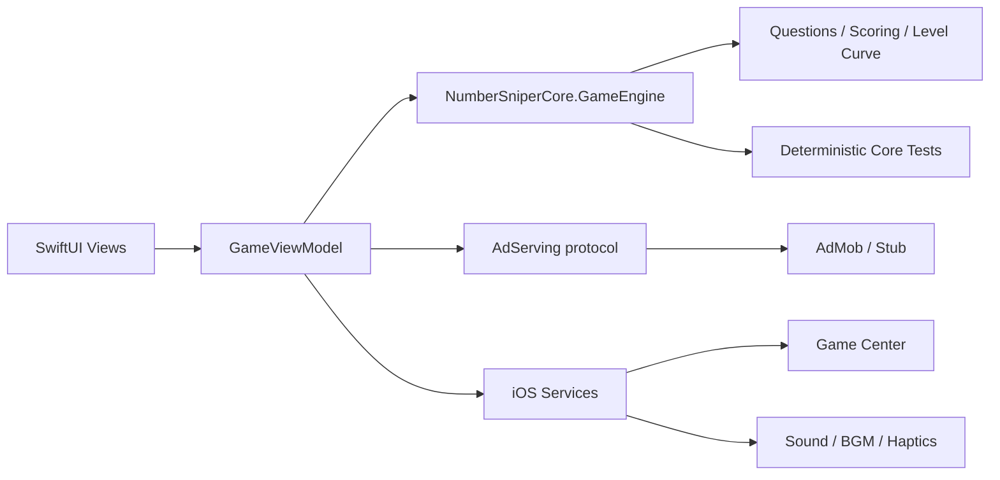

# Architecture

## Overview

Number Sniper separates the iOS presentation layer from a pure Swift game core.
The boundary keeps scoring, question generation, progression, persistence
decisions, and cursor timing testable without launching an iOS Simulator.

## Target and module boundaries

- `NumberSniperCore/` is a Swift package with no UIKit or SwiftUI dependency.
- `NumberSniper/` owns SwiftUI views, view models, platform lifecycle, ads,
  Game Center, haptics, and audio.
- `Config/` owns the app plist and entitlements.
- `NumberSniper.xcodeproj/` composes the app, core package, and Google Mobile
  Ads package.

## Input to state transition

1. `PlayView` renders the current question and moving cursor.
2. A tap is sent to `GameViewModel`, which samples the most recently rendered
   cursor position.
3. `GameEngine` converts the stop position to deviation, judgement, score,
   combo, lives, and progression updates.
4. The view model publishes the resulting state back to SwiftUI.

The model does not use screen coordinates. A position is represented as a ratio
from `0` to `1`, so the same judgement logic works for `0...1`, percentages,
custom ranges, fractions, and larger integer ranges.

## Deterministic question generation

`QuestionGenerator` accepts a `RandomNumberGenerator`. Tests inject
`SeededRandomNumberGenerator`, which makes question sequences reproducible and
allows level-band invariants to be checked over many generated questions.

## Service boundaries

`AdServing` keeps Google Mobile Ads types out of the game core and view model.
The public build uses `StubAdService`, a deterministic non-network
implementation. `AdMobService` remains as an integration example but is not
initialized by default; enabling it requires an appropriate consent flow first.
Game Center, sound, BGM, and haptics are likewise kept in the iOS target rather
than the core package.

## Portfolio-build differences

- Network advertising is disabled by default; the retained AdMob example uses
  Google-provided test identifiers only.
- The Apple Development Team and production bundle identifiers are removed.
- The leaderboard identifier uses the `com.example` namespace.
- Production artwork, recorded judgement audio, and BGM are omitted.
- A procedurally generated icon and four synthesized WAV effects are included.
- Missing BGM is a supported degraded mode: `BGMService` returns without
  replacing the current player when the bundle resource is absent.
